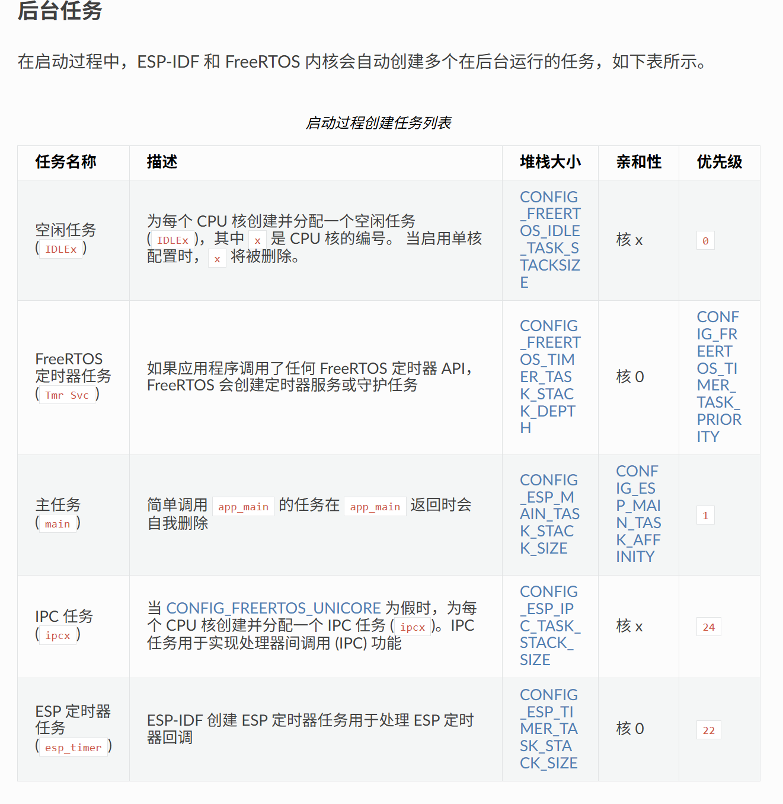

## 问题： ESP32 启动后崩溃并不断重启

错误信息：

**E (282) adc_cali: default vref didn't set**

**ESP_ERROR_CHECK failed: ESP_ERR_INVALID_ARG**

根本原因： 芯片 eFuse 中没有 ADC 校准数据

* 使用了 **adc_cali_create_scheme_line_fitting()** 需要 eFuse 校准值
* 该芯片不支持 Line Fitting 校准方案
* Curve fit 5.5.1弃用

## 问题：Clark 和 Park 变换浮点数运算太慢（ESP无FPU）

解决：使用_IQ()运算（ESPIDF）

`_IQ()` 会把浮点数转成整数表示的小数，

用 MCU 的 **整数运算单元** 直接算数，

避免了浮点库函数的高延迟，

所以在  **无 FPU 的 MCU 上速度提升可达 10–20 倍** 。

## 问题：I2C任务运作太慢，50ms
以为只开启一个任务，没有处理优先级。但ESP+FREERTOS会自动启动很多后台任务，导致I2C的低优先级被挤。

## To Do

可以考虑将数学运算 用IQ格式代替

所以在没有 FPU 的 MCU 上，

用 `_IQmpy()` 代替 `*`，

可以让  **FOC 算法快 5–10 倍** ，并避免溢出。
